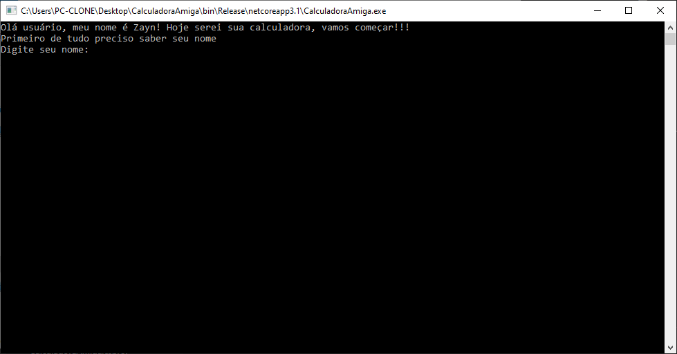

# CalculadoraAmiga
Este software é uma calculadora que interage com o usuário e seu principal objetivo é ajudar nas operações de matemática básica

## Exemplo
"[...] meu nome é Zayn! Hoje serei sua calculadora [...]"

## _Capetura de tela_

## _Download_
Baixe o arquivo abaixo. Descompacte no local desejado em seu computador.

[💻 Download do arquivo .zip](CalculadoraAmiga.zip)

Execute utilizando o comando:

dotnet CalculadoraAmiga.dll

Ou, se voc~e estiver no Windows, pode dar um duplo-clique no ícone do programa.

## _Agradecimentos_
- [Etec Adolpho Berezin](http://eteab.com.br/)

- [Prof. Ermogenes](https://github.com/ermogenes)

- [Prof. Diego](https://github.com/diegoneri)

- [Dev C#](https://github.com/MatheusKhairallah/CalculadoraAmiga)

## Manual do usuário
O programa ira perguntar seu nome, tipo de operação matemática e se deseja ver os créditos do programa e então o programa vai se fechar
